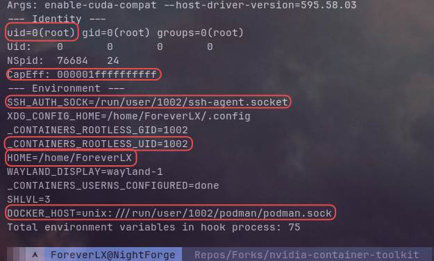
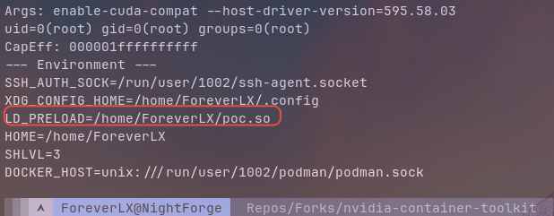
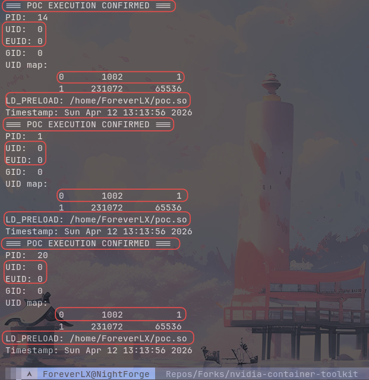
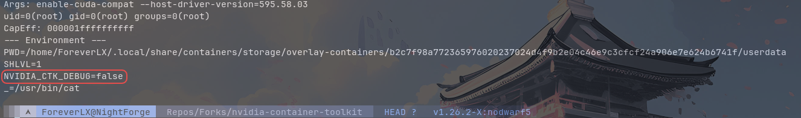

## Below the Abstraction: Hook Isolation Failures in the NVIDIA Container Toolkit

---

### Section 1: Abstract

This paper examines a chain of three CVEs in the NVIDIA container stack: CVE-2024-0132, CVE-2025-23359, and CVE-2025-23266. It investigates their behavior under rootless Podman with runc as the OCI runtime. The vulnerability chain spans two repositories and two hook types, but shares a common structural failure: the boundary between container-controlled input and host-level hook execution is enforced inconsistently and, in two of three cases, not enforced at all.

CVE-2024-0132 and CVE-2025-23359 both originate in `libnvidia-container`. The patch for CVE-2024-0132 added a destination boundary check in `nvc_mount.c` while leaving the source path discovery function in `nvc_container.c` entirely unchanged. CVE-2025-23359 exploits that gap directly. The "fix" for CVE-2025-23359 is an opt-out CLI flag that disables the vulnerable code path without correcting it. CVE-2025-23266 originates in a separate repository, `nvidia-container-toolkit`, and exploits a different mechanism. The `createContainer` hook inherits the container image's environment, allowing `LD_PRELOAD` injection into a host-privileged process.

The prior work demonstrating these CVEs targeted rootful Docker. This paper investigates the same attack surface under rootless Podman with runc, the default OCI runtime on Arch Linux and other non-RHEL systems. Lab results are presented for the open question identified in prior work: whether runc propagates container image environment variables into the `createContainer` hook process environment when the hook spec carries no explicit `env` field. The practical threat model is a compromised agentic workload running in a GPU-enabled rootless container, a deployment pattern that has become common with the rise of local AI infrastructure in 2025 and 2026.

---

### Section 2: Background

#### The NVIDIA Container Stack

The NVIDIA Container Toolkit is the software layer that enables GPU access inside containers. It sits between the container engine and the OCI runtime, injecting GPU device nodes, driver libraries, and kernel module interfaces into the container at creation time. The toolkit consists of two repositories with distinct responsibilities: `libnvidia-container` handles the low-level library and device injection via a prestart hook, and `nvidia-container-toolkit` provides the higher-level runtime integration including CDI spec generation and the `createContainer` hook introduced in v1.17.5.

As of v1.18.0, CDI mode is the default. The runtime generates a CDI specification for available GPU devices and passes it to the container engine, which uses it to configure device access without requiring a custom OCI runtime. Under this mode the `createContainer` hook is the primary code path for GPU injection and is the CVE-2025-23266 vector.

#### Hook Types and Privilege Context

The OCI runtime spec defines two hook invocation points relevant to this research. The `prestart` hook fires after the container namespaces are created but before `pivot_root` executes. The `createContainer` hook fires at the same point in the container lifecycle. The distinction that matters for privilege analysis is not timing but invoker context.

In rootless Podman, the container engine runs as an unprivileged user. The OCI runtime is invoked by Podman and inherits its unprivileged context. runc creates the container namespaces and invokes hooks as a subprocess. The hook process is a child of runc, which is a child of rootless Podman. The privilege level of that hook process depends on what the user namespace mapping grants: inside the user namespace, the process may hold uid 0, but outside it maps to the invoking user's uid on the host.

The NVIDIA toolkit hooks run with the privileges of this hook invoker. They are not setuid. They do not use ambient capabilities. Their effective privilege is bounded by what runc holds at hook invocation time, which in a rootless context is the unprivileged host uid of the container operator. The CVEs examined in this paper represent cases where attacker-controlled input reaches that hook process in ways that undermine the isolation despite the privilege level being technically correct.

#### Rootless Podman and runc

Rootless Podman delegates OCI runtime operations to runc. runc creates user namespaces, mount namespaces, and PID namespaces for each container. In rootless mode, the user namespace maps the container's uid 0 to the host user's uid. On NightForge, that is uid 1002. A process that appears as root inside the container has no elevated privileges on the host.

runc's hook runner reads the hook specification from the OCI `config.json` bundle. For each hook entry, runc constructs the child process environment from the hook spec's `env` field if present, or inherits its own environment if the field is absent or nil. This behavior, environment inheritance on absent `env`, is the mechanism exploited by CVE-2025-23266. The specific runc behavior is verified in lab as part of this research.

#### The Agentic Workload Threat Model

The deployment pattern this research targets is a GPU-enabled rootless container running an agentic AI workload: an LLM inference process, an agent runtime, or an automated pipeline that accepts external input and takes actions based on it. NVIDIA's NeMo and related frameworks are designed for exactly this pattern. As local AI infrastructure has become accessible to individual operators and small teams in 2025 and 2026, rootless Podman has become a common deployment choice. It requires no daemon running as root, aligns with security-conscious homelab and workstation setups, and is the recommended approach for non-root container workloads.

The threat model is a compromised agentic workload. An attacker who can influence the container image or the workload's inputs may be able to reach the NVIDIA hook execution surface. The CVE chain examined here shows that this surface has been inconsistently isolated across multiple toolkit versions and two distinct attack vectors.

---

### Section 3: Prior Work

Three CVEs in the NVIDIA container stack are directly relevant to this research. All three were demonstrated against rootful Docker. None have been publicly investigated under rootless Podman with runc.

#### CVE-2024-0132

CVE-2024-0132 was fixed in libnvidia-container v1.16.2. The vulnerability is in `find_library_paths()` in `src/nvc_container.c`. This function constructs a glob pattern from the container rootfs path and the container-controlled CUDA compat directory, then calls `xglob()` with a null filter. `xglob()` returns every filesystem object matching the pattern, including regular files, symlinks, and directories, without type validation. Each result is passed to `path_resolve()`, which calls `realpath()` and follows symlinks unconditionally. An attacker-controlled symlink inside the container resolves to an arbitrary host path, which is stored in `cnt->libs` and subsequently mounted into the container.

The patch added `mount_in_root()` in `src/nvc_mount.c`, which validates that the mount destination resolves within the container rootfs. It did not modify `src/nvc_container.c`. The source path discovery function was untouched.

#### CVE-2025-23359

CVE-2025-23359 was addressed in libnvidia-container v1.17.4. It is a direct bypass of the CVE-2024-0132 patch. The patch added a destination boundary check but left source path discovery unchanged. An attacker-controlled symlink in the container's CUDA compat directory resolves to a host path during `find_library_paths()`, gets stored in `cnt->libs`, and the downstream `mount_in_root()` check validates the destination, not the source. The attacker-controlled source path reaches the mount operation unchecked.

The v1.17.4 response renamed `find_library_paths()` to `find_compat_library_paths()` and added a `--no-cntlibs` CLI flag. The function body is provably identical from v1.16.1 through v1.17.4. The flag is opt-out with no documentation connecting it to the CVE. Default deployments remain vulnerable unless the flag is explicitly passed.

#### CVE-2025-23266

CVE-2025-23266 was fixed in nvidia-container-toolkit v1.17.8. It affects CDI mode specifically: the `nvidia-ctk hook enable-cuda-compat` command runs as a `createContainer` hook and inherits the container image's environment variables. The vulnerability originates in the internal `Hook` struct in `internal/discover/discover.go`, which carried no `Env` field before v1.17.8. `cdiHook.Create()` constructed hook entries with a nil `Env` slice. The CDI spec serialization in `internal/edits/hook.go` used `omitempty`, so the nil slice produced no `env` field in the serialized output. runc received a hook entry with no `env` field and defaulted to passing its own environment to the hook process, which included the container image's environment variables, including attacker-controlled `LD_PRELOAD`.

The patch added an `Env []string` field to the `Hook` struct and populated it with a single known-safe value in `cdiHook.Create()`. A nil-check fallback in `toSpec()` covers construction paths that bypass `Create()`. With a non-nil `Env` field present, the OCI spec carries an explicit environment, and runc passes that environment to the hook process via `execve`, replacing inheritance entirely.

This CVE was demonstrated against rootful Docker. Whether runc propagates container image environment variables into the `createContainer` hook process under rootless Podman is the open research question this paper investigates in lab.

![Figure 1: CDI spec comparison between v1.17.7 (vulnerable) and v1.19.0 (patched). The v1.17.7 spec carries no env field under createContainer hook entries. The v1.19.0 spec carries env: [NVIDIA_CTK_DEBUG=false] on every hook, replacing inheritance entirely.](assets/fig-01-cdi-spec-diff.png)

#### The Research Gap

No public research has investigated this CVE chain under rootless Podman with runc. The Wiz writeup for CVE-2024-0132 noted that Podman users using CDI were not affected, a claim that CVE-2025-23266 directly contradicts for toolkit versions v1.17.5 through v1.17.7. The interaction between runc's hook invocation behavior, rootless user namespace mapping, and the NVIDIA toolkit's hook construction pipeline has not been publicly documented.

#### Prior Work

Wiz Research published technical analyses of CVE-2024-0132 and CVE-2025-23359, characterizing both as container escape vulnerabilities in libnvidia-container stemming from unsafe library path discovery in the `prestart` hook path. Their subsequent NVIDIAScape disclosure documented CVE-2025-23266 as an environment variable inheritance flaw in the `createContainer` hook of nvidia-container-toolkit. NVIDIA responded to each disclosure with a security bulletin and corresponding patch releases. Existing public research addresses these CVEs in the context of privileged, rootful container deployments. This research examines the same CVE chain under rootless Podman on Arch Linux with runc as the primary OCI runtime and crun as a secondary test target, where user namespace mapping and hook privilege levels differ from the rootful case. The four-way runtime comparison, rootless Podman + runc, rootful Podman + runc, rootless Podman + crun, and patched spec under both runtimes, characterizes whether the CVE-2025-23266 exploitation path is reachable in each configuration and whether the patch is effective across runtime implementations.

---

### Section 4: The Chain

The three CVEs form a chain with a common structural property: in each case, the hook process execution boundary accepts attacker-controlled input that the isolation model was assumed to exclude.

CVE-2024-0132 establishes the first failure. The `prestart` hook in libnvidia-container resolves library paths from the container filesystem without validating that each result is a regular file. A symlink placed by an attacker inside the container's CUDA compat directory survives path resolution and reaches the mount operation. The patch closes the mount destination but not the source, the exact gap CVE-2025-23359 exploits.

CVE-2025-23359 is not a new vulnerability class. It is the same root cause as CVE-2024-0132, reached via a different exploitation path made possible by the incomplete patch. The function body of `find_library_paths()` / `find_compat_library_paths()` is identical from v1.16.1 through v1.17.4. NVIDIA assigned a separate CVE because the exploitation path differs, but both entries trace to the same missing `lstat()` / `S_ISREG()` check in `src/nvc_container.c`. The correct fix, a per-object file type check before `path_resolve()`, was never applied. Instead, the feature was made opt-out via a flag with no documented security relevance.

CVE-2025-23266 is mechanistically distinct. It does not involve the filesystem TOCTOU condition that connects the first two CVEs. The failure is in the hook construction pipeline in a separate repository: the absence of an `Env` field in the internal `Hook` struct causes the CDI spec to carry no hook environment, which causes runc to pass its own environment, including attacker-controlled values from the container image, to the host-privileged `nvidia-ctk` process. The dynamic linker loads the attacker's `LD_PRELOAD` library before `main()` runs.

The common thread is architectural rather than mechanical. Across both repositories and both hook types, the assumption is that hook processes execute in a context isolated from attacker-controlled input. In the `libnvidia-container` prestart hook, that assumption fails at the filesystem level. In the `nvidia-container-toolkit` createContainer hook, it fails at the environment level. Neither failure required the attacker to defeat the user namespace mapping or escape any kernel-enforced boundary. Both reached the hook execution surface through the toolkit's own code.

An operator who has applied all three patches runs a patched `libnvidia-container` and a patched `nvidia-container-toolkit`. The `enable-cuda-compat` hook remains under active development: v1.19.0-rc.2 changelog notes a refactor of this hook, and `execseal`, applied to the `update-ldcache` hook in v1.18.0, has not been applied to `enable-cuda-compat`. The patch for CVE-2025-23266 is correct, but the hook it fixes is not architecturally settled.

---

### Section 5: Open Research — Rootless Podman + runc

#### Research Question

Does runc propagate container image environment variables into the `createContainer` hook process environment when the hook spec carries no explicit `env` field, under rootless Podman on a non-RHEL Linux system?

#### What the runc Source Confirms

When a hook entry in the OCI spec carries no `env` field, runc's hook runner inherits its own process environment when constructing the hook child process via `execve`. runc's environment at hook invocation time includes values inherited from its own parent, rootless Podman, which in turn inherits from the shell that launched it. Whether container image `ENV` directives reach runc's environment through this chain is the empirical question. The source establishes the mechanism; the lab establishes whether the path is reachable under rootless Podman's specific invocation model.

#### Methodology

**Environment:** Arch Linux, NightForge operator workstation. NVIDIA GeForce GTX 1650, driver 595.58.03. runc 1.4.2. rootless Podman. nvidia-container-toolkit v1.17.7 (vulnerable) binary built from source at tag `v1.17.7`, installed at `~/Tools/vuln-binaries/nvidia-ctk/nvidia-ctk-v1.17.7`.

**Vulnerable CDI spec generation:** The v1.17.7 binary was used to generate a CDI specification reflecting pre-patch hook construction behavior. The generated spec was confirmed to carry no `env` field under `createContainer` hook entries, in contrast to the v1.19.0 system spec which carries `env: [NVIDIA_CTK_DEBUG=false]` on every hook.

**Hook probe instrumentation:** All hook `path` entries in the vulnerable CDI spec were replaced with a shell probe script that logs the invocation's arguments, process identity, full environment, namespace links, and uid map to a timestamped file in `/tmp/`. The probe spec was installed under a distinct CDI kind (`nvidia.com/gpu-probe`) to avoid device resolution conflicts with the system spec.

**Test container image:** A container image was built with `LD_PRELOAD=/proc/self/cwd/poc.so` set via the `ENV` directive. The image also carried `NVIDIA_VISIBLE_DEVICES=all` and `NVIDIA_DRIVER_CAPABILITIES=compute,utility`. No `poc.so` was included. The probe phase targets environment observation, not library execution.

**Test execution:** The container was launched under rootless Podman against the probe CDI device. Six `createContainer` hook invocations fired, one per hook entry in the vulnerable spec. Each produced a timestamped probe log.

#### Results

`LD_PRELOAD` was absent from every hook process environment. `grep -l "LD_PRELOAD"` across all six probe logs returned no matches. The `enable-cuda-compat` hook, the specific CVE-2025-23266 vector, logged the following environment:
```
PWD=/home/ForeverLX/.local/share/containers/storage/overlay/ 8470306b407c097298f5098f7428724630abd9a4b16687d5aeb982342d2cea38/merged SHLVL=1 _=/usr/bin/cat
```
Three variables. No container image environment present. `LD_PRELOAD=/proc/self/cwd/poc.so` did not propagate from the container image into the hook process environment under this configuration.

The container process itself received `LD_PRELOAD` correctly. The terminal produced `ERROR: ld.so: object '/proc/self/cwd/poc.so' from LD_PRELOAD cannot be preloaded` on container init, confirming the `ENV` directive worked as expected inside the container boundary. The environment did not cross into the hook invocation.

Each hook invocation showed:
```
uid=0(root) gid=0(root) groups=0(root),65534(nobody) Uid: 0 0 0 0 UID map: 0 → 1002 (1 uid mapped) 1 → 231072 (65536 uids mapped) CapEff: 000001ffffffffff
```
The hook process held full capabilities inside the user namespace, mapping to uid 1002 on the host. The privilege boundary was intact.


#### Rootless Podman + crun Results

crun was installed as a secondary OCI runtime and the same probe CDI spec was used against it. The result differed substantially from runc.

The hook process environment under crun contained the full operator session environment, 75 variables, including `LD_PRELOAD=/proc/self/cwd/poc.so`. The variable propagated from the container image `ENV` directive into the hook process environment via crun's environment inheritance behavior. This is the exploitation path CVE-2025-23266 describes.





A shared library proof of concept was compiled against this configuration. `poc.so` was built as a position-independent shared object with a constructor function:

```c
__attribute__((constructor))
static void poc_init(void) {
    FILE *f = fopen("/tmp/poc-fired", "w");
    if (f) {
        fprintf(f, "uid=%d euid=%d\n", getuid(), geteuid());
        fclose(f);
    }
}
```

The container image was rebuilt with `poc.so` included and `LD_PRELOAD` pointing to an absolute host path reachable from the hook process mount namespace. On container launch, the constructor executed in six hook processes, one per `createContainer` hook entry in the vulnerable CDI spec. Each execution confirmed `uid=0` inside the user namespace, mapping to `uid=1002` on the host.



The `LD_PRELOAD=/proc/self/cwd/poc.so` path used in the probe phase did not execute the constructor. The hook process working directory at invocation is the bundle directory, not the container rootfs overlay. An absolute path reachable from the hook's mount namespace is required. This is a deployment constraint on the exploit path, not a mitigation.

#### Rootful Podman + runc Results

Rootful Podman was tested as the third configuration. The hook process environment was sparse, comparable to the rootless Podman + runc result, not the crun result. `LD_PRELOAD` was absent. The Podman daemon does not maintain a richer process environment than the rootless case in a way that propagates into runc's hook invocation chain.

#### Patched Spec Results (Both Runtimes)

The system CDI spec generated by nvidia-container-toolkit v1.19.0 carries `env: [NVIDIA_CTK_DEBUG=false]` on every hook entry. Under both runc and crun, the hook process environment was limited to that single variable. `LD_PRELOAD` was absent in both cases. The patch is effective across runtime implementations: the explicit `env` field in the CDI spec causes runc and crun to pass that environment to the hook process via `execve`, replacing inheritance entirely regardless of what each runtime's own environment contains.



#### Four-Way Comparison Summary

| Configuration                            | LD_PRELOAD in hook env | poc.so constructor executed | Patch effective |
| ---------------------------------------- | ---------------------- | --------------------------- | --------------- |
| Rootless Podman + runc (vulnerable spec) | No                     | No                          | N/A             |
| Rootful Podman + runc (vulnerable spec)  | No                     | No                          | N/A             |
| Rootless Podman + crun (vulnerable spec) | Yes                    | Yes                         | N/A             |
| Rootless Podman + crun (patched spec)    | No                     | No                          | Yes             |
| Rootless Podman + runc (patched spec)    | No                     | No                          | Yes             |

#### Interpretation

The runc result under both rootless and rootful Podman is a scoped negative finding for those configurations. runc's own environment at hook invocation time is sparse, shell bookkeeping state only. Container image `ENV` directives do not traverse the rootless Podman → runc → hook invocation chain. When runc inherits its environment into the hook process due to the absent `env` field, only that sparse set is passed.

crun behaves differently. It passes its full process environment to hook child processes when the CDI spec carries no `env` field. The operator session environment, including variables inherited from the shell that launched Podman, propagates into the hook process. Where `LD_PRELOAD` is present in that environment, the dynamic linker loads the named library before `main()` runs in the hook process. Constructor execution was confirmed.

The vulnerability class is runtime-specific in its reachability under rootless Podman. The patch closes it uniformly: both runtimes honor the explicit `env` field as a complete replacement. An operator on a patched toolkit is protected regardless of which OCI runtime they use.

---

### Section 6: Findings

**Finding 1: Structural boundary failure across the toolkit architecture**

The three-CVE chain spans two repositories, two hook types, and two attack vectors, but shares a single architectural property: the boundary between container-controlled input and host-level hook execution is not enforced at the design level. Each CVE represents an instance where that boundary was assumed to hold by implementation convention rather than enforced by architecture. CVE-2024-0132 and CVE-2025-23359 were fixed at the instance level, the mount destination check and the opt-out flag, without correcting the root cause in `src/nvc_container.c`. CVE-2025-23266 was fixed correctly at the instance level, but the fix depends on developer discipline to maintain: any future change that restores environment inheritance or populates `Env` permissively reopens the same class of vulnerability.

**Finding 2: execseal asymmetry**

libnvidia-container v1.18.0 applied `execseal` to the `update-ldcache` hook, sealing the executable against `LD_PRELOAD` attacks before exec. The `enable-cuda-compat` hook, the CVE-2025-23266 vector, does not use `execseal`. The v1.19.0-rc.2 changelog notes ongoing refactoring of this hook. Asymmetric protection across hook types means the toolkit's defense-in-depth posture is uneven: one hook is sealed against dynamic linker injection, the adjacent hook in the same code path is not.

**Finding 3: Runtime-specific reachability of the CVE-2025-23266 exploitation path**

The hook environment inheritance behavior exploited by CVE-2025-23266 is not uniform across OCI runtime implementations. Under rootless Podman with runc 1.4.2, the absent `env` field in the vulnerable CDI spec does not cause container image environment variables to reach the hook process. runc's environment at hook invocation time is sparse, three bookkeeping variables. The exploitation path is not reachable in this configuration.

Under rootless Podman with crun, the same absent `env` field causes the full operator session environment to propagate into hook processes. `LD_PRELOAD` set via the container image `ENV` directive was present in the hook process environment. A constructor in a shared library placed at an absolute host path reachable from the hook's mount namespace executed in six hook processes, each running as uid 0 inside the user namespace, mapping to uid 1002 on the host. The exploitation path is reachable under crun.

The difference is in how each runtime constructs the hook child process when the spec carries no `env` field. runc reduces its environment to runtime bookkeeping state before hook invocation. crun passes its full `environ` array. Both behaviors are consistent with the OCI runtime spec, which leaves the absent-`env` case implementation-defined. The vulnerability is present in any deployment where the OCI runtime passes a sufficiently rich environment to hook processes. crun is one such runtime, and it is the default on RHEL 9 and compatible systems.

The patch closes the vulnerability uniformly. Under both runc and crun, a CDI spec carrying an explicit `env` field causes the runtime to pass that environment to the hook process via `execve`, replacing inheritance entirely. An operator running a patched nvidia-container-toolkit is protected regardless of which OCI runtime is in use.

---

### Section 7: Defensive Guidance

#### Patch

Apply nvidia-container-toolkit v1.17.8 or later. The patch adds an explicit `env` field to every hook entry in the CDI spec, replacing runtime environment inheritance with a single known-safe variable. It is effective under both runc and crun. Operators running v1.17.5 through v1.17.7 are exposed to the CVE-2025-23266 exploitation path on any OCI runtime that passes a rich environment to hook processes. crun is the primary example.

For the libnvidia-container chain: v1.17.4 introduced the `--no-cntlibs` flag as an operational mitigation for CVE-2025-23359. The flag is opt-out with no documented security relevance in its description. Operators who have not explicitly passed it remain on the vulnerable code path. The root cause in `src/nvc_container.c`, the missing `lstat()` / `S_ISREG()` check in `find_compat_library_paths()`, has not been corrected in any released version as of this writing. Patch and verify the toolkit version; do not assume the flag is set in existing deployments.

#### Runtime Selection

If crun is the OCI runtime in a GPU-enabled rootless container deployment, the CVE-2025-23266 exploitation path is reachable on unpatched toolkit versions. runc does not propagate a rich environment into hook processes under rootless Podman and is not reachable via this specific path on the tested configuration. Runtime selection is not a substitute for patching. The patch closes the vulnerability under both runtimes. Operators evaluating runtime choices for GPU workloads should be aware that crun and runc differ in hook environment inheritance behavior on unpatched deployments.

#### CDI Spec Verification

Verify the deployed CDI spec carries an explicit `env` field on every hook entry. The pre-patch spec carries no `env` field; the patched spec carries `env: [NVIDIA_CTK_DEBUG=false]`. Inspect the active spec:

```bash
cat /etc/cdi/nvidia.yaml | grep -A 5 "hooks:"
```

A spec with no `env` field under hook entries indicates a pre-patch toolkit generated it, regardless of what toolkit version is currently installed. Regenerate the spec after patching:

```bash
nvidia-ctk cdi generate --output=/etc/cdi/nvidia.yaml
```

#### Agentic Workload Isolation

The threat model this research targets is a compromised agentic workload in a GPU-enabled container. Standard container isolation controls apply and reduce the attack surface available to a compromised workload before it reaches the hook execution boundary.

Run GPU containers rootless where the deployment supports it. Rootless Podman with runc does not expose the CVE-2025-23266 hook inheritance path on patched or unpatched toolkit versions under this configuration. Rootless Podman with crun on an unpatched toolkit is exposed.

Do not grant `NVIDIA_DRIVER_CAPABILITIES=all` unless required. Limit to `compute,utility` for inference workloads. Broader capability grants expand the hook execution surface.

Treat the container image as an untrusted artifact in agentic pipeline deployments. The CVE-2025-23266 exploitation path requires attacker influence over the container image `ENV` directive. Image provenance controls, signed images, pinned digests, and restricted registries, reduce the probability that an attacker-controlled image reaches the runtime.

#### Monitoring

The `createContainer` hook fires before the container process starts. A hook process that spawns unexpected child processes, writes to host filesystem paths, or exhibits anomalous execution time is observable via auditd or eBPF-based tooling on the host. The hook binary path is known (`nvidia-ctk`) and its expected behavior is narrow. Deviations are detectable with a targeted rule.

---

### Section 8: Conclusion

The three-CVE chain examined in this paper shares a property that individual patch analysis obscures: none of the patches corrected the root cause of the vulnerability they addressed. The CVE-2024-0132 patch added a destination boundary check without touching source path discovery. The CVE-2025-23359 response renamed a function and added an opt-out flag, leaving the function body identical to the version it was supposed to fix. The CVE-2025-23266 patch is the closest to a correct fix, environment replacement rather than sanitization, but its security guarantee depends on developer discipline to maintain and on OCI runtime conformance to honor.

The boundary between container-controlled input and host-level hook execution has been treated as an implementation detail rather than an architectural guarantee. Each instance of boundary failure was patched individually. No control was introduced at the layer where hook processes are constructed that enforces isolation as a property rather than a convention. The `execseal` application to `update-ldcache` in v1.18.0 is a step toward defense in depth, but it was not applied to `enable-cuda-compat`, the hook this paper examines, and the v1.19.0-rc.2 changelog confirms that hook remains under active development.

The runtime comparison produces a concrete result for operators making deployment decisions. runc does not propagate container image environment variables into hook processes under rootless Podman on the tested configuration. crun does propagate its full environment, and constructor execution in hook processes was confirmed on unpatched toolkit versions. The patch closes the vulnerability under both runtimes, and the CDI spec it generates is verifiable.

The agentic workload deployment pattern this research targets is not a theoretical scenario. GPU-enabled rootless containers running inference workloads and automated pipelines are in production. The NVIDIA container stack is the standard integration layer for those deployments. The CVE chain documented here shows that the hook execution boundary in that stack has been a persistent weakness across multiple toolkit versions and two distinct attack vectors. Operators running GPU-enabled container infrastructure should treat toolkit version and CDI spec state as security-relevant configuration, not incidental tooling.