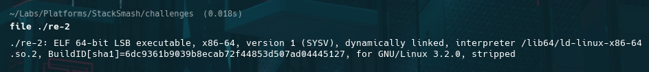
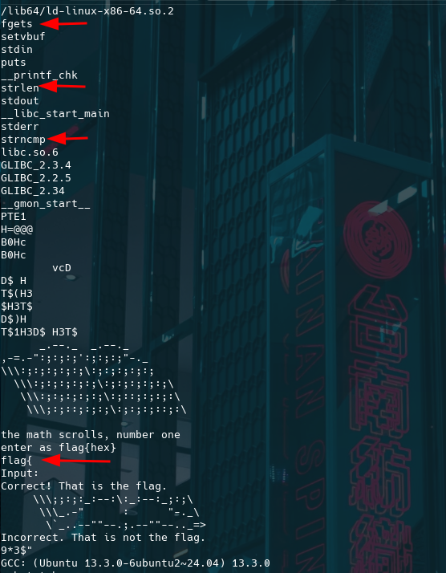
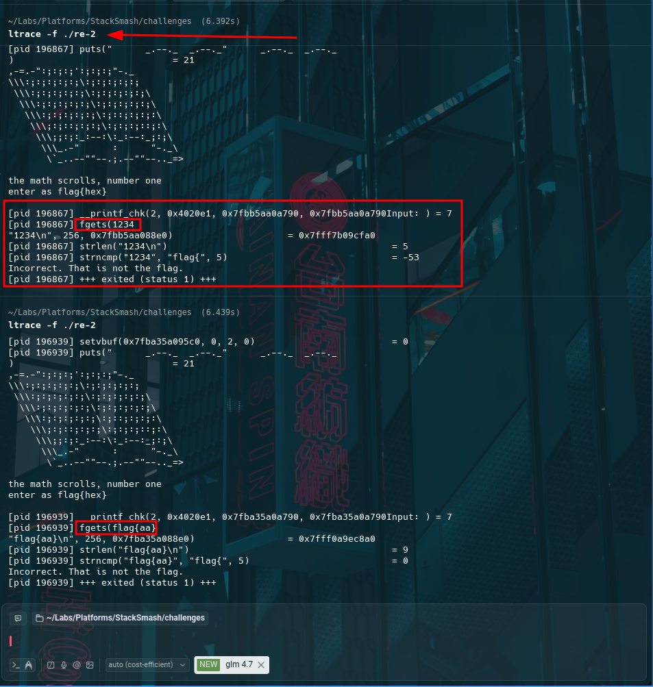
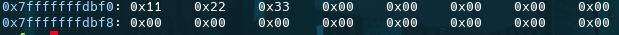
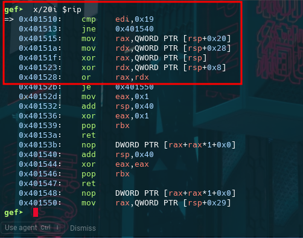
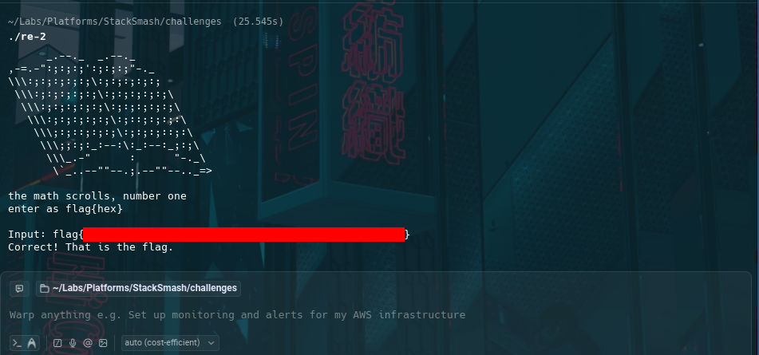

# StackSmash CTF — re-2 Reverse Engineering

## Metadata
- **Challenge:** re-2
- **Platform:** StackSmash
- **Category:** Reverse Engineering
- **Difficulty:** Beginner → Intermediate
- **Architecture:** x86_64 (64-bit ELF)
- **Protections:** Stripped, dynamically linked
- **Time Spent:** ~3 hours (multi-session)
- **Tools:** file, strings, ltrace, gdb (gef)

## Objective
Reverse engineer a stripped 64-bit ELF binary to determine the correct `flag{hex}`-formatted input that satisfies internal validation logic and triggers the success message.

---

## Recon

### Binary identification
    file ./re-2

### Embedded strings
    strings ./re-2

Key observations from strings:
- The expected wrapper begins with `flag{`
- libc usage suggests early gating (`fgets`, `strncmp`, `strlen`)
- The prompt indicates the payload is **hex-encoded** inside `flag{...}`

### Dynamic reconnaissance
    ltrace -f ./re-2

Observation: input is rejected unless it begins with the `flag{` prefix, confirming an early prefix gate before deeper validation occurs.

---

## Analysis

### Hex decoding and buffer construction
After passing format checks, the binary decodes each pair of hex characters into a byte and writes decoded bytes into a local buffer for later validation.

### XOR-based comparison
Instead of calling `memcmp`, the binary compares buffers using XOR/OR operations across chunks, implementing a custom equality check.

### Length constraint
The validator enforces an exact decoded length of **25 bytes**, implying **50 hex characters** inside `flag{...}`.

---

## Outcome / Validation
Submitting the correct `flag{hex}` input produces the expected success message.

Flag (redacted): `flag{████████████████████████████████}`

---

## Key takeaways
- Prefix and format constraints reduce the search space early.
- Hex decoding introduces strict structural requirements (even length, fixed decoded size).
- XOR/OR comparison patterns commonly replace obvious library comparisons.
- Debugger-assisted extraction reduces transcription errors and improves reproducibility.

## Techniques & patterns
- **Constraints-first:** document prefix/charset/length requirements before deeper logic.
- **Decode → buffer → compare:** model validation as a pipeline.
- **Recognize chunked XOR/OR checks:** a common signature for custom equality logic.

## Defensive notes
Client-side deterministic validation remains recoverable via static and dynamic analysis. Stripping increases effort but does not prevent reconstruction of validation logic.

