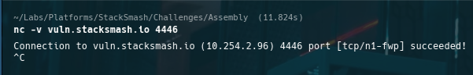
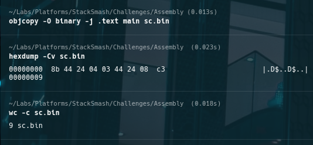
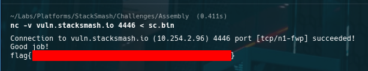

# StackSmash CTF — shellcode-2 (Callable Function Shellcode: `add(a, b)`)

## Metadata
- **Challenge:** shellcode-2
- **Platform:** StackSmash
- **Category:** Shellcode / Assembly (x86, 32-bit)
- **Difficulty:** Beginner
- **Date:** 2026-__-__
- **Time Spent:** ~__ minutes
- **Goal:** Provide shellcode callable as a function that returns `a + b`
- **Tools:** nc, gcc (`-m32`, `-nostdlib`), objcopy, hexdump, wc

## Objective
Craft x86 (32-bit) shellcode that the remote harness calls like a function. The shellcode must compute `a + b` and return the sum using the expected calling convention.

## Recon

### Connection and baseline behavior
    nc -v vuln.stacksmash.io 4446

*Initial connection / baseline behavior of the remote harness.*

## Analysis

### Calling convention assumption (32-bit cdecl)
I treated this as a standard 32-bit cdecl-style callable function:

- `arg1` at `[esp+4]`
- `arg2` at `[esp+8]`
- return value in `eax`
- return via `ret`

### Minimal `add(a, b)` shellcode
The smallest reliable implementation is:

    mov eax, [esp+4]
    add eax, [esp+8]
    ret

Why this works:
- the harness supplies arguments on the stack
- `eax` is the conventional return register in 32-bit x86
- `ret` returns control back to the harness for validation

## Solution

### Assembly (`start.S`)
    .global _start
    .intel_syntax noprefix

    _start:
        mov eax, [esp+4]
        add eax, [esp+8]
        ret

### Build, extract, and verify bytes
    make
    objcopy -O binary -j .text main sc.bin
    hexdump -Cv sc.bin
    wc -c sc.bin

*Verified the exact shellcode bytes and payload size before remote testing.*

### Execute against remote
    nc -v vuln.stacksmash.io 4446 < sc.bin

## Outcome / Validation
Observed a successful validation response from the service (flag redacted if needed):

*Successful remote validation output.*

## Key takeaways
- Harnessed shellcode behaves like a function: respect the ABI and return convention.
- `ret` keeps the harness in control for validation.
- Always verify the exact bytes and payload size before remote delivery (`hexdump`, `wc -c`).

## Techniques & patterns
- **Reusable pattern: shellcode as ABI**  
  Model the task as implementing a tiny function under a known calling convention.
- **Reusable pattern: byte + size verification**  
  Use `hexdump -Cv` for correctness and `wc -c` for quick size sanity checks.

## Defensive notes (optional)
If an attacker can execute code, they can implement arbitrary computation under process ABI constraints. Real mitigations aim to prevent code execution or constrain what it can do (NX/W^X, ASLR/PIE, sandboxing).

