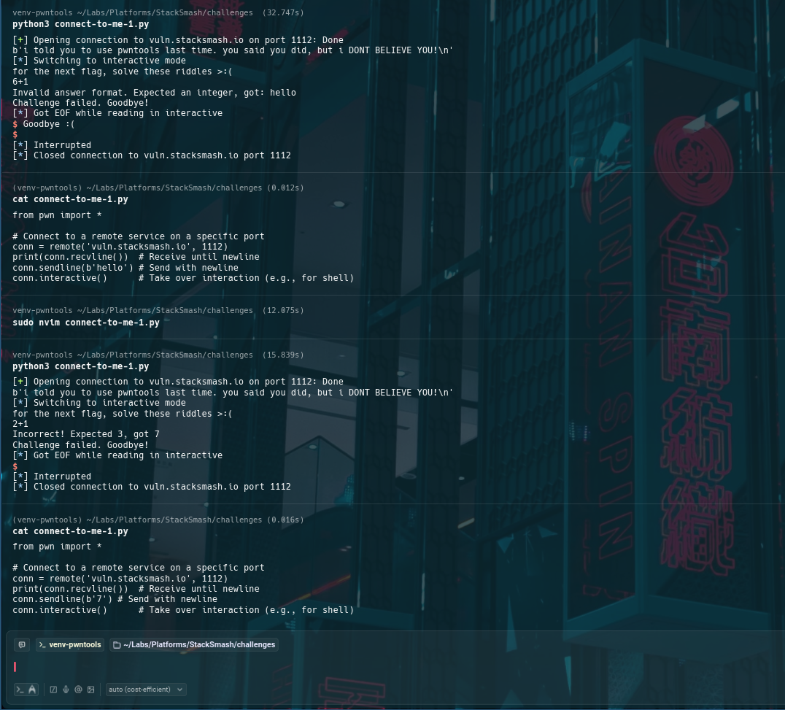
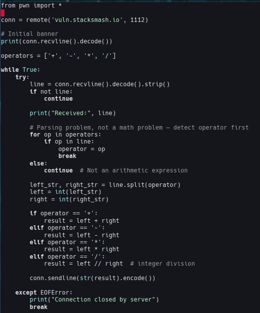
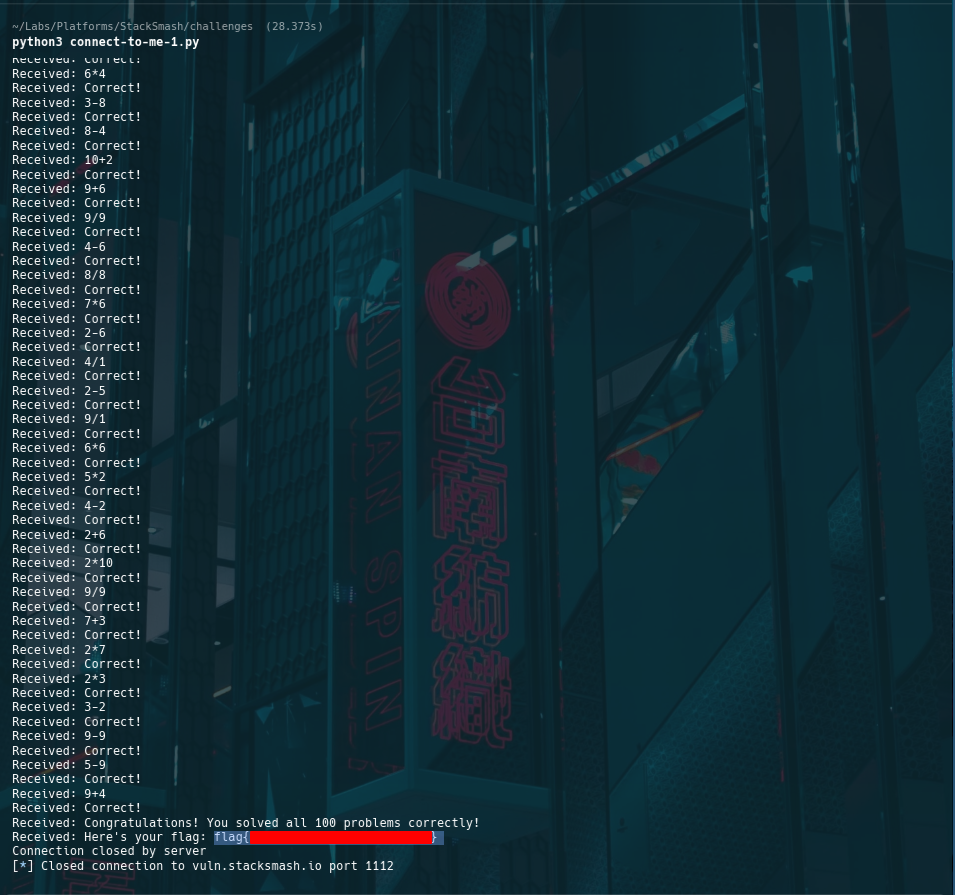

# StackSmash CTF — connect-to-me-1 Automation

## Metadata
- **Challenge:** connect-to-me-1
- **Platform:** StackSmash
- **Category:** Scripting / Automation
- **Difficulty:** Beginner
- **Tools:** Python, pwntools, nc
- **Time Spent:** ~0.5 hours (trial & error)

## Objective
Automate a remote prompt/response service that streams arithmetic expressions. Each expression must be parsed and answered correctly to continue; any incorrect response terminates the session.

## Recon

### Manual interaction
A manual connection confirmed a plain-text prompt/response protocol and strict failure on incorrect answers:

    nc vuln.stacksmash.io 1112

## Analysis

### Core insight
This challenge is fundamentally a **parsing + control-flow** problem, not a math problem.

The key tasks are:
- reliably read lines from the service
- detect which lines contain an expression
- parse operands and operator
- compute a deterministic integer answer
- send the response back in the expected format

### Parsing strategy
High-level loop:
1. read incoming lines
2. ignore non-expression text
3. detect an operator (`+`, `-`, `*`, `/`)
4. split operands
5. compute the result as an integer
6. send the answer
7. repeat until completion

### Implementation detail: explicit operator handling
Operator detection and evaluation were implemented explicitly (not via `eval`) to keep behavior predictable and safe.

## Outcome / Validation
The automation successfully solved the full sequence of prompts and completed the session.

## Key takeaways
- Parsing problems are control-flow problems: build a reliable **read → parse → respond** loop.
- Be explicit: deterministic operator handling prevents edge-case surprises.
- pwntools simplifies I/O — correctness still depends on your parsing rules.

## Techniques & patterns
- **Reusable pattern: protocol-first automation**  
  Treat the challenge as a protocol: read → classify → parse → compute → respond → repeat.
- **Reusable pattern: explicit evaluation**  
  Prefer deterministic evaluation logic over dynamic evaluation for both safety and predictability.

## Defensive notes
Even simple interactive protocols can be hardened with:
- rate limits
- input validation
- challenge randomization
- timeouts and replay detection

